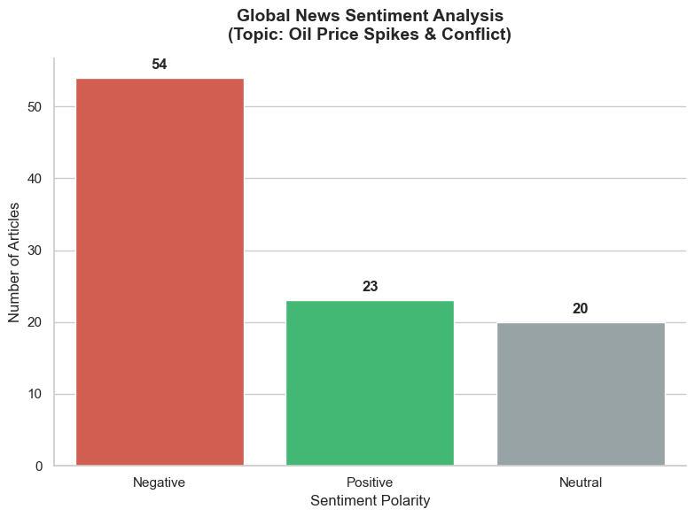

# 📰 Global News Sentiment Engine: NLP Market Analysis

### 🎯 Objective
The goal of this project was to build an automated Natural Language Processing (NLP) pipeline that scrapes live global news, processes unstructured text, and calculates the overarching market sentiment (Positive, Negative, Neutral) surrounding macroeconomic events.

### 🛠️ Methodology & Technical Stack
This project required extracting unstructured text via API and applying statistical sentiment scoring using Python.

* **API Integration:** Utilized the `NewsAPI` to query a 30-day historical window of global publications, using boolean search parameters (`("oil prices" OR "crude oil") AND (conflict OR spike)`) to pull highly relevant market data.
* **Data Engineering:** Extracted, cleaned, and flattened nested JSON responses into a structured Pandas DataFrame
* **Natural Language Processing:** Implemented the `NLTK` library and the **VADER** (Valence Aware Dictionary and Sentiment Reasoner) lexicon to mathematically score the polarity of unstructured text.
* **Categorical Aggregation & Visualization:** Translated continuous mathematical sentiment scores into discrete business categories and visualized the market polarity using `Seaborn` and `Matplotlib`.

### 📊 Visualization: 30-Day Market Sentiment
*(The breakdown of news sentiment surrounding the recent oil price spike)*

 

### 💡 Key Insights & Model Limitations
The engine processed a 97-article sample:
* **Macro Sentiment:** The algorithm accurately captured the overwhelming market anxiety, with **Negative sentiment (55%)** dominating the coverage.
* **Model Nuance & Edge Cases:** The project highlighted a critical limitation of lexicon-based NLP models. Headlines containing terms like "Surge" (typically a positive financial indicator) alongside geopolitical conflict were occasionally misclassified as "Positive." This demonstrates the necessity of context-aware models (like LLMs) over purely mathematical text scorers for complex geopolitical events.
